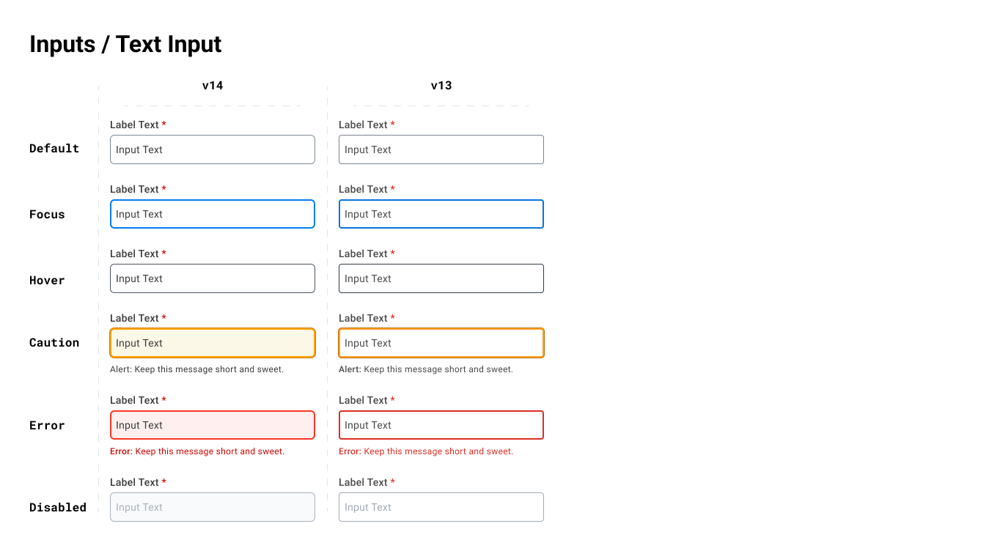

# Canvas Kit 14.0 and Tokens v3.0 Visual Changes

This guide contains an overview of the changes in Canvas Kit v14. If you have any issues, feel free
to report them [here](https://github.com/Workday/canvas-kit/issues). For a mode detailed overview of
the changes in v14, please view our
[v14 Upgrade Guide](/help/upgrade-guides/canvas-v14-upgrade-guide/).

> **Note:** The visual changes highlight v14 changes + the use of v3 tokens.

- Avatar in Preview has background colors of: 'blue' | 'amber' | 'teal' | 'purple' (default is
  'blue')
- Avatar sizes include: 'extraExtraSmall' | 'extraSmall' | 'small' | 'medium' | 'large' |
  'extraLarge' | 'extraExtraLarge'
- This change is both component and token level change.

- Breadcrumbs no longer have an underline. This change was made to align with the new brand
  direction and to highlight that stand alone links should not have an underline.
- This change is a component level change and not a token change.

- Primary Button background color is 'blue' (default)
- Primary Button inverse variant changed from white to a shade of blue (blue25).
- This is only a token level change.

- Secondary Buttons changed from back on hover to a shade of neutral.
- Secondary Button inverse variant focus: the background changed from white to translucent.
- Secondary Button inverse variant hover: the background changes from gray to transparent.
- This a token level change.

- The border radius on Tertiary Buttons is now rounded.
- The underline has been removed on the default state. Hoever and active still show the underline.
- This is a component level change.

- Cards removed the default box shadow.
- We also added a borderless and filled variant.
- This a component level change.

- Error and Alert states now have either a light red or light amber background.
- This is a component and token level change.

- Error and Alert states now have either a light red or light amber background.
- This is a component and token level change.

- Error and Alert states now have either a light red or light amber background.
- The border radius on inputs is now 6px vs 4px in v13..
- This is a component and token level change.

- Error and Alert states now have either a light red or light amber background.
- The border radius on inputs is now 6px vs 4px in v13..
- This is a component and token level change.

- Error and Alert states now have either a light red or light amber background.
- The border radius on inputs is now 6px vs 4px in v13..
- This is a component and token level change.

- A low emphasis was added for default and inverse variants.
- This is a component level change.

- Hover state changed to a shade lighter of gray.
- This was a component and token level change.

- Some colors shifted to match the new brand direction.
- This is a token level change.

- The default color changed to a darker shade of gray for better contrast.
- The inverse variant also changed to a lighter shade for better contrast.
- This is a token level change.

- The component now uses the Avatar from the Preview package.
- Some colors shifted to match the new brand direction.
- This is a components and token level change.

- Status Indicator now uses rounded corners.
- A new variant was added: 'AI'.
- Some colors shifted to match the new brand direction, most notably the `caution` variant.
- New semantic variants where added.

- Some colors shifted to match the new brand direction.
- This is a token level change.
