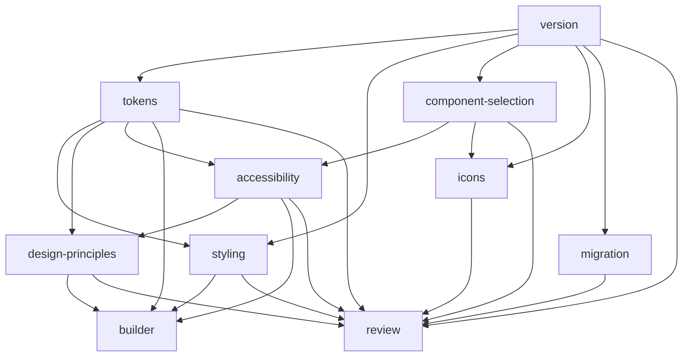

# Canvas Kit Skills

> Browse the skill catalog in Storybook under **Agent Skills**
> ([docs](https://workday.github.io/canvas-kit/?path=/docs/agent-skills-overview--docs)).

This directory holds agent skills for **Canvas Kit consumers** — apps that depend on
`@workday/canvas-kit-react` and want an agent to write, style, and review UI that follows the
design system correctly. Written against the **current generation**: Canvas Kit **v16** +
`@workday/canvas-tokens-web` **4.4** (Sana Canvas theme). `/sana-canvas-kit-version` detects when an
install is older and hands off to the upgrade path instead of applying current-gen tables as truth.

This is **not** the maintainer skill set for working on the `canvas-kit` repo's own source
(`system.legacy.*` in `modules/**/lib/**`, `cornerShapeStencil`, Chromatic class twins, publishing
concerns — see [STYLE.md](../STYLE.md) / [AGENTS.md](../AGENTS.md)). A maintainer-focused skill
pack is a possible future addition; don't assume it exists yet.

## Skills

| Skill | Covers | Depends on |
| ----- | ------ | ---------- |
| [`sana-canvas-kit-version`](sana-canvas-kit-version/SKILL.md) | Detect installed Canvas Kit / tokens-web versions; which generation's guidance applies; upgrade-guide lookup (MCP first, GitHub fallback) | — |
| [`sana-canvas-kit-tokens`](sana-canvas-kit-tokens/SKILL.md) | Which design token to use by role (color, spacing, shape, type); accessible color pairings and contrast framework; CSS-variable import troubleshooting | version |
| [`sana-canvas-kit-styling`](sana-canvas-kit-styling/SKILL.md) | How to apply styles: `createStyles`, `createStencil`, `cs` prop, `handleCsProp`, layout without `Box`/`Flex` | version, tokens |
| [`sana-canvas-kit-design-principles`](sana-canvas-kit-design-principles/SKILL.md) | Which component fits a use case; component-specific dos/don'ts; embedded snapshot, no live lookups | tokens, a11y |
| [`sana-canvas-kit-accessibility`](sana-canvas-kit-accessibility/SKILL.md) | ARIA, accessible names, keyboard support, focus management, live regions, forms a11y | component-selection, tokens |
| [`sana-canvas-kit-component-selection`](sana-canvas-kit-component-selection/SKILL.md) | Avoiding `@deprecated` exports/props; Main vs Preview vs Labs package tiers | version |
| [`sana-canvas-kit-icons`](sana-canvas-kit-icons/SKILL.md) | System, accent, and expressive icons; sizing; deprecated icon APIs; `icon-migration` codemod | version, component-selection |
| [`sana-canvas-kit-migration`](sana-canvas-kit-migration/SKILL.md) | Running `@workday/canvas-kit-codemod` across majors; upgrade-guide checklist | version |
| [`sana-canvas-kit-builder`](sana-canvas-kit-builder/SKILL.md) | Building custom components with `createComponent`/`createContainer`/`createModelHook`/etc. | styling, tokens, a11y, design-principles |
| [`sana-canvas-kit-review`](sana-canvas-kit-review/SKILL.md) | Report-only grep/checklist review of a diff/branch for design-system compliance | version, all of the above |

## How they fit together

Start with `/sana-canvas-kit-version` whenever a table in another skill might be version-specific —
every skill above that says "REQUIRED SUB-SKILL" expects it to have run first.

## Scope notes

- **Design principles are a static snapshot**, not a live lookup. `sana-canvas-kit-design-principles`
  was built from a one-time fetch of an internal design-docs source and embeds only the
  public-facing usage guidance (When to Use, Do's/Don'ts, accessibility annotations) — it does not
  tell an agent to re-fetch that source, call an MCP server, or hit a design site at runtime. If the
  snapshot goes stale, refresh it manually the same way and update the snapshot date in its
  `references/` files.
- **Content/UI-text style is out of scope.** These skills don't cover writing guidelines (grammar,
  capitalization, terminology) — only structural/visual/interaction guidance.
- **No theming skill.** Sana theme setup (`data-theme="sana-canvas"`) is covered inline in
  `version` and `tokens`, not as a separate skill.
